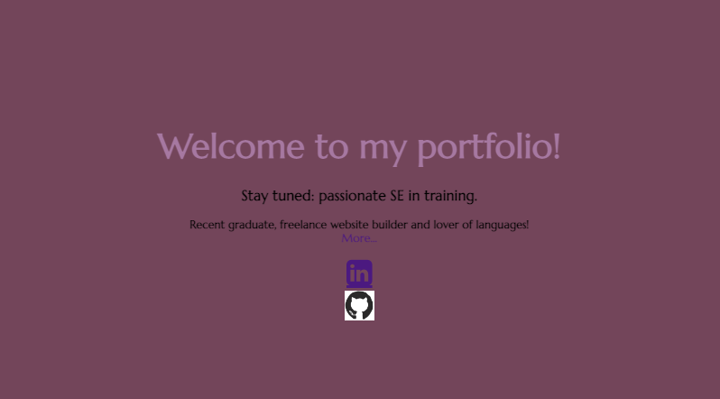
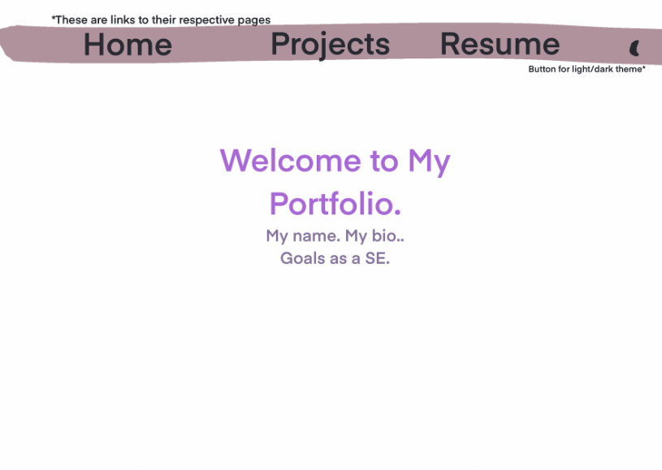
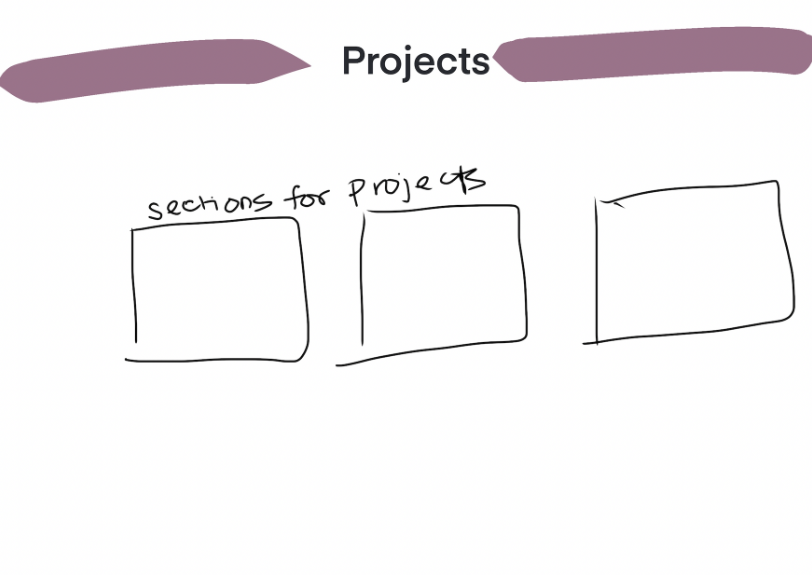

# WELCOME TO _MY PORTFOLIO_!

## Technologies Used:

- CSS
- HTML
- Javascript
- Git & GitHub
- VS Code

## Installation Instructions

1. Fork this repository
2. Clone the repository to you local device in your terminal via HTTPS or SSH links
   - "git clone **\_\_\_**
3. Open with VS Code

## User Stories

    * As a friend of this website's developer, I am excited to see their understanding of website development reflect in this site over time.
    * As a hiring manager, I want to see the skills of this candidate via their site's code and visual appearance/interaction.

## Wireframes

Granted, these are quite sloppy, but they were modified over time.

## Victories and Defeats

- I ran into some trouble making the color-theme button toggle between two colors, but with lots of experimentation, I solved my by introducing a third variable to assign different values to, and now it works! Yipee!
- When it came to addressing media responsiveness, I learned how important the mobile first approach is!
